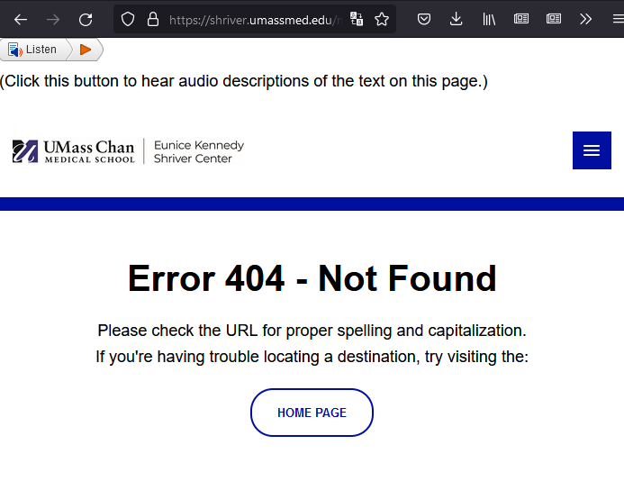

**NOTE: this was originally written in 2022, but never finished. This was updated and published in 2023, but some links are now out-of-date, etc.**

It's quite difficult to find real, credible, information on the internet nowadays.

Something that has made this easier (for me, at least) has been to search specifically for content on `.edu` domains, since that TLD is restricted to accredited institutions. This is as simple as prefixing your Google search with `inurl:edu `.

I've been doing this for a while with no issues, so you can imagine my surprise when I recently tried to find information about some "fat burner" pills that were being sold on Amazon and searched for `inurl:edu nobi fat burner` in the off-chance it was mentioned in some study/paper.

Dang! If UMass Med, Penn State, _and_ UC Santa Cruz are recommending these things, then they must be safe and effective.

However, just to do my due diligence, I should probably at least click on the first link and see what it says about-

Oh, that's odd.

This doesn't look like a university website?

Maybe I clicked the wrong one, let me go back and copy and paste the URL.

Huh, a 404 page this time?

Weird. Oh well.

If three university sites are recommending these entirely unregulated pills to me, then they must be good!

 
... Alright, I'll drop the schtick.

 
 

# What's happening here?

I decided to look a little bit deeper into the first search result.

First, I took the raw URL and `curl`ed it, but I got a 404. For some reason, it didn't redirect to the spam site.

My first instinct here was that _something_ was checking if the client was the "expected" browser somehow. For example, it could be checking if the `User-Agent`, `Referer`, or `Accept` headers matches what would be sent from Chrome, [TLS fingerprinting](https://daniel.haxx.se/blog/2022/09/02/curls-tls-fingerprint/), etc.

Thankfully it was one of my first guesses. Adding the `Referer` of `https://www.google.com/` did the trick:

Admittedly, at this point I was a _tiny_ bit worried that this was something on my local machine, so I opted for the most optimal solution for checking: Sending my brother an unprompted discord message asking him to `curl` a suspicious URL with no context. Sadly it turned out that he _did_, in fact, want context.

How unfortunate.

Regardless, I eventually convinced him to run it and confirmed it wasn't an issue on my end.

Now at this point, I knew that it was happening on their server(s), and under which conditions it happened (coming from Google Search results), but I had no way of figuring out _why_ it was happening. (e.g. something in their reverse proxy, some PHP code, etc)

The only indicator I had here was the very unusual `haircki` cookie that was being set when visiting the regular page. It _could_ technically be legitimate, but it seemed extremely out-of-place for a uni website.

By sheer luck, a [sourcegraph search](https://sourcegraph.com/search?q=context:global+haircki&patternType=standard) turned up a result for `haircki`, which lead me to a GitHub repo containing WordPress malware samples:

https://github.com/stefanpejcic/wordpress-malware/blob/master/01.06.2021/index.php

After briefly looking over that sample from another site, I feel confident in saying that it produces the same behavior of search engine link hijacking that I'm seeing on the `umassmed.edu` site.

The answer here turned out to be less interesting than I thought, just another case of websites running vulnerable versions of WordPress and/or WP plugins.

# How widespread is it?

Given what I've shown so far, you would be justified if your first comment was:

_"You've only provided three example sites, I'd hardly call that representative of all .edu domains"_

As such, here are the following institutions I've found with compromised sites / pdf hosting at the time of writing (2022-09-07):

Compromised sites:
* **University of California Santa Cruz, United Status**
    * httpx://digitalkarnak.ucsc(dot)edu/dsbptweight/how-many-fcel-keto-pills-should-i-take-a-day
* **Bangladesh Army International University of Science and Technology, Bangladesh**
    * httpx://baiust(dot)edu.bd/VCHdvwg/diy-diet-pill-60b8c4d
* **Thai Nguyen University, Vietnam**
    * httpx://mysite.tnu(dot)edu.vn/renlearn/A49749f-as-seen-on-tv-diet-pill

Compromised PDF hosting:
* **The International Institute of Business & Technology, Australia**
    * httpx://library.iibt(dot)edu.au/Celebrity_Slim_Program_Guide/redir_esc?o=W4Q2L0
* **Johns Hopkins University, Whiting School of Engineering, United Status**
    * httpx://www.clsp.jhu(dot)edu/wp-content/uploads/2015/10/WS12-Summer-SentimentData.pdf
* **University of Port Harcourt, Nigeria**
    * httpx://uniport(dot)edu.ng/herbalife_pitch_2014_free/trackid=7228393 (requires Referer)
* **School of Environmental Science and Management, Nepal**
    * httpx://schems(dot)edu.np/Idiots_Guide_To_Loosing_Weight/redir_esc?n=O0C9L9
* **Unknown institution, Uruguay**
    * httpx://mail.elijoestudiar(dot)edu.uy/food-what-the-heck-should-i-eat/?view_all.cgi=DikTnZPit5OE&sitesec=reviews&redir_esc=y
* **University of Arkansas for Medical Sciences, United States**
    * httpx://neuroscience.uams(dot)edu/Type-2-Diabetes-Can-Be-Reversed/redir_esc?n=Q9D6R4
* **The Dow University of Health Sciences, Pakistan**
    * httpx://vcon.duhs(dot)edu.pk/Weight_And_Body_Solutions/redir_esc?k=Y3C4N1

Update (2023-07-29):
* **University of Pittsburgh, United States**
    * httpx://dom.pitt(dot)edu/rNob-CWeEr/fat-burning-pills-that-actually-work-McK
* **Program for Infant Toddler Care, United States**
    * httpx://pitc(dot)edu/bdietzFFN/fat-burner-Oh4-gnc-review/
* **University of Georgia College of Veterinary Medicine, United States**
    * httpx://vet.uga(dot)edu/NwII-CnDyA/best-drinks-to-dYVyq-lose-belly-fat
* **University of Namibia, Namibia**
    * httpx://library.unam(dot)edu.na/keto-cgikx/personality-change-xtxvo-after-weight-loss/
* **Jindal Institute of Behavioural Sciences, India**
    * httpx://jibs(dot)edu.in/DzdietKXK/evlution-fat-burner-cbd-oil/
* **Almaty Management University, Kazakhstan**
    * httpx://gsb.almau(dot)edu.kz/LdietjwTH/does-distance-running-burn-fat-K7J/
* **University of Georgia, United Status**
    * httpx://ifp.uga(dot)edu/LVN-UdXsLk/keto-yOda-ultra-fat-burn-pills

# Those are just hackers though
_"Okay, sure, the sites were hacked. That doesn't make the universities less credible. That's just dumb."_

You know what, fair. Maybe it's unreasonable to say that all .edu sites are non-credible because a few of them had poor maintenance/security. This was not something that the univeristies would ever willingly advertise, and it was out of there control.

In fact, while looking into these compromised sites, I found a great paper accessible via Penn State University's CiteSeerX instance:

https://citeseerx.ist.psu.edu/viewdoc/download?doi=10.1.1.711.1013&rep=rep1&type=pdf

In this paper, they describe the exact behavior of these compromised sites only accessible via certain IPs/`User-Agent` header(s)/`Referrer` header(s).

It's great to see this paper on accessible via Penn State University's domain, as I found no instance of this malware on their site while searching.

It's only slightly unfortunate that there was no need for any malware, as the fat burner pills are advertised in the Penn State University Collegian paper anyways though:

https://www.collegian.psu.edu/studentadvice/5-best-fat-burners-for-women-2022-female-fat-burning-pills/article_6082d0f4-7931-11ec-9b80-a3411d9937dd.html

Oh well.

