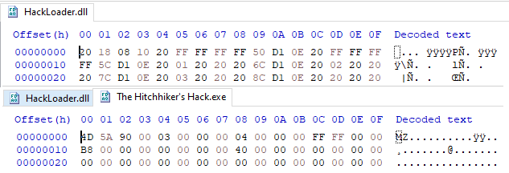

## Hashes (SHA256)
For identification purposes, the observed files/payloads and their hashes are listed below.

| Filename                  | SHA256                                                           |
| ------------------------- | ---------------------------------------------------------------- |
| The Hitchhiker's Hack.zip | E0DF57A03B7B6285A2F1B88BAD66CE9FC39B20140A8BA211A5DD966F3BE9CB90 |
| The Hitchhiker's Hack.exe | 40F0377678702CC90A08AF9CDA27573955B028EF584505D1C4DC8C89D98D1F06 |
| HackLoader.dll            | 1A8AA80396ABBF481F26B9D0DCE12DBA13A5EAF1E851A9AE73B64F4FC3236044 |
|                           |                                                                  |
|                           |                                                                  |

## Preface
Over the weekend, I decided to take a look at some video game "gold hacks", available on YouTube. With a quick search for "gold hack" (sorting by upload date), I found this &lt;sarcasm&gt;_totally legitimate_ [video](http://archive.is/gXmeI)&lt;/sarcasm&gt;.

Being in dire need of this gold, I quickly followed the download link, extracted the files, and ran the exe. Unfortunately, however, I didn't receive my WoW gold, and now there are weird charges on my credit card :(.

Okay, that's not exactly true, but I think it illustrates my point. Lets take a look at what this application really does.

# Dropper
The linked `http://pc.cd/ielitalK` URL redirects to `https://my.pcloud.com/publink/show?code=ielitalK`, a file host serving the `The Hitchhiker's Hack.zip` file.

The zip appears to contain two binaries, `The Hitchhiker's Hack.exe` and `HackLoader.dll`.

However, upon taking a look at both files in a hex editor, it becomes apparent that the `HackLoader.dll` doesn't have a valid PE header:

