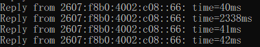
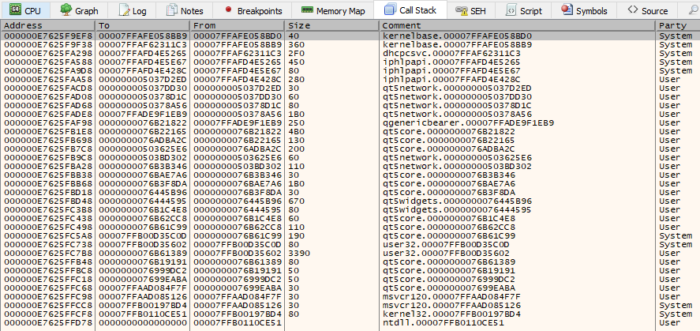

# What?
Late last year, I started experiencing some unusual intermittent connection issues on my Desktop. In general, I had a stable connection with average latency; however, at (seemingly) random times throughout the week, I would start experiencing sudden 2000ms+ latency spikes every couple of seconds.

This made all audio/video calling software unusable and most online games unplayable.

This issue appeared to line up with my cross-country move from Washington State to South Carolina, so there were too many factors to easily pinpoint the issue. However, as it mainly only effected gaming and audio/video calls, I didn't put too much focus on it.

Over the past couple of months I have (slowly) tried to figure out why this was happening, with little luck until today.

# Why?

Initially, the only thing that was clear about the issue was that it was limited to my desktop computer **only**. My laptop and other devices connected to the wifi did not have this issue, even when placed in the exact same spot as the desktop.

First, I purchased a new, highly-reviewed, wifi adapter on Amazon. It didn't resolve the issue. It did, however, come with an offer for a free 64GB flash drive in exchange for a good reviews.

(That was a pretty terrible purchase overall)

Later, (for unrelated reasons) I built an entirely new desktop computer, not using anything from the old one, except the new wifi adapter. This included a fresh install of Windows 10.

It was great, this new computer had no issues! I had suspected that my old motherboard's USB ports might have been damaged during the move to SC, so that must have been the case. Everything is good now, right?

**No. Everything is not good now.**

A few weeks later, and the issue suddenly began happening on the new computer also, and I had no idea what the cause could be.

I tried using multiple different wifi adapters that I owned.

I tried changing the wifi channel, as it appeared to overlap a neighbors. 

I tried turning off Windows Update Delivery Optimization (p2p update sharing). After turning this off and restarting, the issue _appeared_ to be resolved, but then reappeared later.

At one point, my wifi issue even annoyed one of my brothers so badly, due to dropping Skype calls, that he bought me another (slightly less sketchy) wifi adapter on Amazon. This appeared to temporarily resolve the issue after installing the Realtek driver and restarting, but then it came back.

Nothing seemed to work.

---

Today, in a last-ditch desperate attempt at fixing the issue, I:
* Turned off the box fan in my room
* Unplugged my wireless Wacom drawing tablet's USB dongle.
* Closed FireFox
* Closed MediBang Paint Pro

**The issue stopped.**

I immediately suspected interference from the wireless drawing tablet or box fan, so tried those again, but they were not the cause.

I couldn't possibly imagine how a web browser or drawing application could cause this, but I tried anyway.

First I ran FireFox, opened multiple tabs on different sites, and waited... 

Nothing

Then I ran MediBang Paint Pro.

# WHY!?

Why the hell would digital painting software cause wifi lag spikes?

As it turns out, there are [multiple](https://www.reddit.com/r/medibangpaint/comments/br6ruw/medibang_interrupting_wifi_connection/) [instances](https://www.reddit.com/r/medibangpaint/comments/aj440q/help_medibang_makes_my_discord_calls_lag/) [of](https://www.reddit.com/r/medibangpaint/comments/enuucb/wifi/) [people](https://twitter.com/SomeLizardGuy/status/1223575145597423616) [complaining](https://www.deviantart.com/trelock/journal/Need-Help-Medibang-s-disdain-for-my-Wifi-606655928) about this issue with MBPP.

If we take a quick look with ProcMon, we can see that it's definitely doing something odd.

At the exact same time the lag spikes occur, MBPP starts querying the registry keys for all of you network interfaces.

To dig a bit deeper into why this is happening, we can attach to the process with a debugger (x64dbg here), and set breakpoints on the Win32 Reg* APIs.

Eventually, our `RegOpenKeyExInternalW` breakpoint is hit, and we can take a look at the call stack to determine where this is being called.

Looking at the call stack, we can see that first non-system library in the callstack is qt5network.

Surprisingly, no more debugging is needed, as a quick google search for "q5network ping issue" will lead you to [QTBUG-40332](https://bugreports.qt.io/browse/QTBUG-40332?focusedCommentId=390766&page=com.atlassian.jira.plugin.system.issuetabpanels%3Acomment-tabpanel).

If I understand correctly, any Qt5 (<5.14) application using `QNetworkAccessManager` will check for wifi interface changes every 10 seconds for the purpose of [bearer management](https://doc.qt.io/qt-5/bearer-management.html), causing massive lag spikes and/or packet drops entirely. Even if `QNetworkAccessManager` is instantiated internally for something simple, like an HTTP request.

I suppose the workaround is simple enough, set the environment variable `QT_BEARER_POLL_TIMEOUT` to `-1`.

I just wish I knew that around 8 months ago.

# TL;DR

Qt5 has been crippling my wifi system-wide for past 7-8 months, just by running MediBang Paint Pro. I stupidly attributed it to many other things, because, honestly, who would expect Qt to be the cause of their system-wide wifi problems?

# Related

* https://invent.kde.org/graphics/krita/-/commit/d4eaaa63af8dc769acf79cd497e741f1de9be31b
* https://github.com/sqlitebrowser/sqlitebrowser/issues/1209
* https://github.com/mumble-voip/mumble/issues/1585
* https://community.amd.com/thread/209327
* https://github.com/Mudlet/Mudlet/issues/1587
* https://github.com/MultiMC/MultiMC5/issues/1422
* https://lostdomain.org/2017/06/17/qt-qnetworkaccessmanager-causing-latency-spikes-on-wifi/